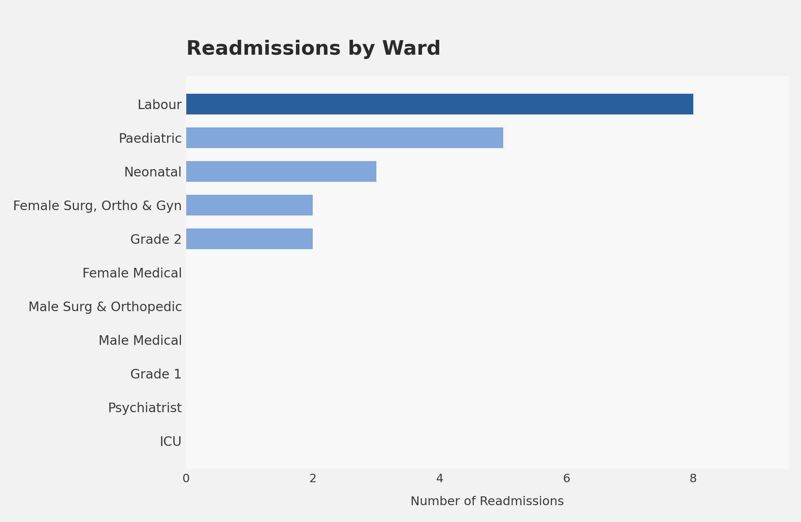
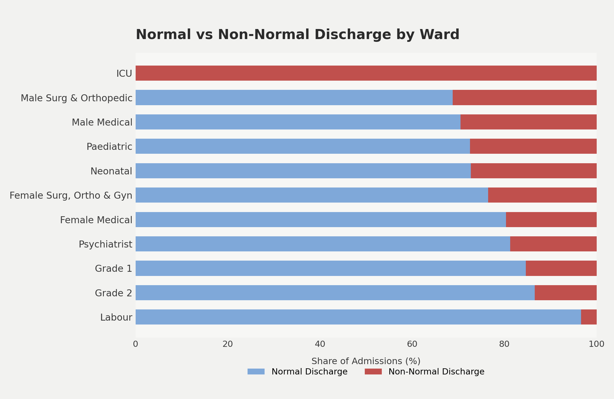
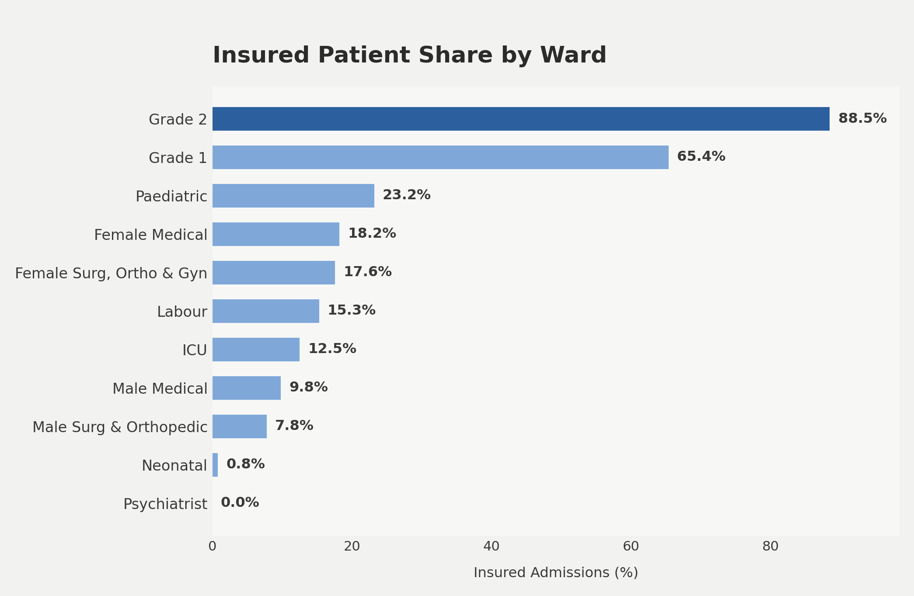
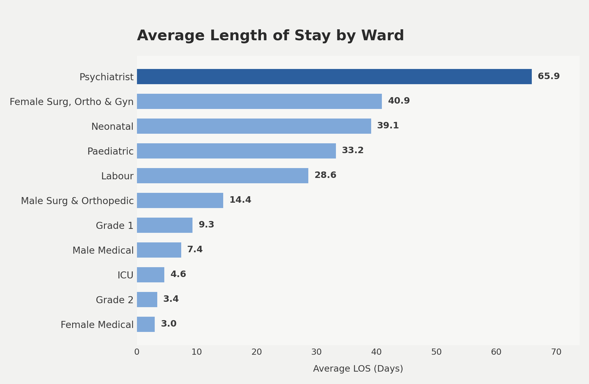
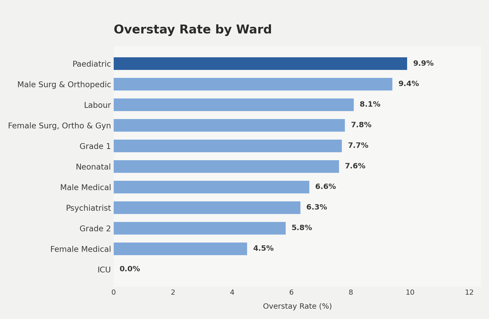

# Health Records SQL Analysis, Kigoma Facility

Analysis of hospital discharge records (905 admissions) using SQL, exploring readmissions, discharge outcomes, insurance coverage, and length of stay across wards.

**Dataset:** `patient_discharge_records`, 905 admissions across 11 wards.

---

## Analytical Questions

### 1. Which ward has the highest number of readmissions?
**File:** `1_Readmission by ward.sql`

```sql
SELECT
    COUNT(*) AS total_admissions,
    COUNT(DISTINCT patient_number) AS unique_patients,
    COUNT(*) - COUNT(DISTINCT patient_number) AS readmissions
FROM discharges;
```

**Result:** 905 total admissions · 885 unique patients · **20 readmissions** (~2.2% overall rate).



**Insight:** Readmissions concentrate almost entirely in maternal/child wards, where **Labour (8), Paediatric (5), and Neonatal (3)** account for 16 of 20 total readmissions (80%). Six of eleven wards had zero readmissions, pointing to a targeted rather than hospital-wide issue.

---

### 2. What is the split between normal and non-normal discharges by ward?
**File:** `2_Normal vs Non-normal discharge by ward.sql`

```sql
SELECT
    ward,
    COUNT(*) AS "Total_Admissions",
    SUM(CASE WHEN discharge_reason = 'Normal Discharge' THEN 1 ELSE 0 END) AS "Normal",
    SUM(CASE WHEN discharge_reason != 'Normal Discharge' THEN 1 ELSE 0 END) AS "Non_Normal",
    ROUND(100.0 * SUM(CASE WHEN discharge_reason != 'Normal Discharge' THEN 1 ELSE 0 END) / COUNT(*), 1) AS "Pct_Non_Normal"
FROM discharges
WHERE ward IS NOT NULL
GROUP BY ward
ORDER BY "Pct_Non_Normal" DESC;
```



**Insight:** **ICU is 100% non-normal**, expected for critical care but worth confirming against clinical norms. **Male Surg & Orthopedic (31%)** and **Male Medical (30%)** trend notably higher than their female-ward counterparts (20–24%), a pattern consistent across two independent wards. **Labour has the lowest non-normal rate (3.4%)** despite the highest volume.

---

### 3. Which ward has the highest share of insured (non-cash) patients?
**File:** `3_Which ward has the highest share of insured patients.sql`

```sql
SELECT
    ward,
    COUNT(*) AS total_admissions,
    SUM(CASE WHEN sponsor = 'Cash' THEN 1 ELSE 0 END) AS cash_admissions,
    SUM(CASE WHEN sponsor IN ('NHIF','MHIS','NSSF','CHF','Other Insurance')
             THEN 1 ELSE 0 END) AS insured_admissions,
    SUM(CASE WHEN sponsor IN ('Fast Track','Strategies','Jkt Bulombola')
             THEN 1 ELSE 0 END) AS other_admissions,
    ROUND(100.0 * SUM(CASE WHEN sponsor IN ('NHIF','MHIS','NSSF','CHF','Other Insurance')
                          THEN 1 ELSE 0 END) / COUNT(*), 1) AS insured_pct
FROM discharges
WHERE ward IS NOT NULL
GROUP BY ward
ORDER BY insured_pct DESC;
```



**Insight:** **Grade 2 (88.5%)** and **Grade 1 (65.4%)**, the paying-tier wards, are overwhelmingly insurance-funded, while **Neonatal (0.8%)** and **Psychiatrist (0%)** are almost entirely cash-funded. This highlights an access gap: the wards serving the most vulnerable patients have the least insurance coverage.

---

### 4. What is the average length of stay by ward?
**File:** `4_avg_los_by_ward_and_outcome.sql`

```sql
SELECT
    ward,
    discharge_reason AS "Outcome",
    COUNT(*) AS "Admissions",
    ROUND(AVG(days), 1) AS "Avg_LOS_Days"
FROM discharges
WHERE ward IS NOT NULL
GROUP BY ward, discharge_reason
ORDER BY "Avg_LOS_Days" DESC;
```



**Insight:** **Psychiatrist stands out sharply at 65.9 days average**, more than 1.5x the next-highest ward (Female Surg, Ortho & Gyn at 40.9). **Grade 2** and **Female Medical** sit at the opposite end (~3 days), showing how widely "normal" LOS varies by ward type, which is why the overstay analysis (below) uses a ward-relative threshold rather than one fixed cutoff.

*Note: a few extreme individual `days` values (300+) were flagged during initial review and should be validated as genuine stays vs. data-entry errors.*

---

### 5. Which wards have the highest rate of statistical overstays?
**File:** `5_overstay_patterns.sql`

```sql
WITH ward_stats AS (
    SELECT ward, AVG(days) AS avg_los, STDDEV(days) AS stddev_los
    FROM discharges
    WHERE ward IS NOT NULL
    GROUP BY ward
)
SELECT
    d.ward,
    COUNT(*) AS "Total_Admissions",
    SUM(CASE WHEN d.days > (w.avg_los + 2 * w.stddev_los) THEN 1 ELSE 0 END) AS "Overstay_Count",
    ROUND(100.0 * SUM(CASE WHEN d.days > (w.avg_los + 2 * w.stddev_los) THEN 1 ELSE 0 END) / COUNT(*), 1) AS "Pct_Overstay"
FROM discharges d
JOIN ward_stats w ON d.ward = w.ward
GROUP BY d.ward
ORDER BY "Pct_Overstay" DESC;
```

An overstay is defined as any admission exceeding its ward's average LOS by more than 2 standard deviations, a statistical outlier threshold that adapts to each ward's normal range.



**Insight:** **Paediatric (9.9%)** and **Male Surg & Orthopedic (9.4%)** have the highest overstay rates, while **ICU (0%)** has none. Male Surg & Orthopedic is a particularly notable case: its *average* LOS is fairly low (14.4 days), but a distinct subset of patients stays dramatically longer (some 86–104 days), pulling the ward into outlier territory. Combined with its elevated non-normal discharge rate from Question 2, this ward is a strong candidate for a discharge-process review.

---

## Key Takeaways

1. **Readmissions cluster in maternal/child wards** (Labour, Paediatric, Neonatal), accounting for 80% of all readmissions.
2. **Insurance coverage is sharply divided by ward tier**, with Grade 1/2 wards insurance-heavy; Neonatal and Psychiatric care are almost entirely out-of-pocket.
3. **Male medical/surgical wards show consistently higher non-normal discharge rates** than equivalent female wards.
4. **"Normal" length of stay varies enormously by ward** (3 days in Grade 2/Female Medical vs. 66 days in Psychiatrist), so any LOS-based flagging needs to be ward-relative.
5. **Male Surg & Orthopedic recurs across three independent metrics** (elevated non-normal rate, high overstay rate, extreme individual outliers), the clearest single candidate for a discharge-process review.

---

## Data Notes & Caveats

- Sponsor field required manual disambiguation: "Fast Track," "Strategies," and "Jkt Bulombola" were treated as a separate "other" category rather than assumed to be insurance, since their nature is unconfirmed.
- A handful of very long `days` values (300+) were flagged during initial review and should be validated before being used in further LOS-based analysis.
- Percentage-based comparisons are used throughout in preference to raw counts, since ward sizes vary by more than 25x (e.g., ICU: 8 admissions vs. Labour: 236 admissions), and raw counts alone would understate risk in smaller wards.
